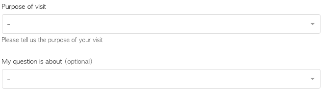
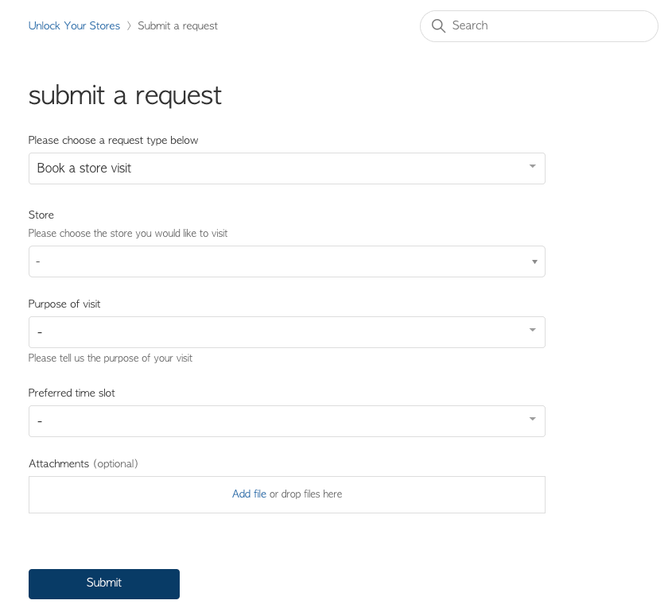

# Ticket Subject/Description Customizer
This script allows you to **hide the required subject/description fields** in a Zendesk contact form and **replace them with any text and/or custom fields values**.

## Use case
By default, the subject and the description fields are required in any Zendesk contact form, however, in some situations, you may not need those fields in your forms, as you may just want to collect specific data from custom fields.

In these situations, you can use this script to hide your subject/description fields and fill those fields values with any predefined information (including dynamic value taken from custom fields) without requiring any input or making this information visible to your end-user.

### Form Example:
<kbd></kbd>

In the form above, you could set the subject/description values as:

```javascript
{
  formId: 360000685459,
  subject: 'Request to visit a store for {{Purpose of visit}}',
  description: 'A customer have requested to visit a store for {{Purpose of visit}} and have a question about {{My question is about}}.'
}
```

If you have multiple conditional fields with the same name in the same form, you can use the ticket field ID number to make sure that the correct field will be taken into consideration, so the same example as above would be something like:

```javascript
{
  formId: 360000685459,
  subject: 'Request to visit a store for {{360009915379}}',
  description: 'A customer have requested to visit a store for {{360009915379}} and have a question about {{My question is about}}.'
}
```

If you decide to specify the label names as the way to reference your fields, you need to make sure to specify them exactly as they are in your contact form, ignoring any extra information that Zendesk adds by default.

So if you have a field that is showing in your form as **Field name (optional)**, where the **(optional)** information is added by Zendesk by default, you should only specify your field name as **{{Field name}}**, always referring them in between double curly-braces, whether they are the label names or the ticket field IDs.

## How to install
Copy the **script.js** file to your Help Center code, and set the **ticketFormConfig** variable as below:

```javascript
const ticketFormConfig = [
  {
    // Set your ticket form ID
    formId: 360000685459,

    // Set your desired form subject
    subject: 'New visit request to {{Store}} at {{Preferred time slot}}',

    // Set your desired form description
    description: 'A new request to visit store {{Store}} tomorrow at {{360009915399}}.'
  },
  {
    formId: 360000000000,
    subject: 'This is the new subject of your second form',
    description: 'This is the new description of your second form'
  }
];
```

You can add as many settings as you need if you have multiple forms and you want to customize all of them.

## Working demo
<kbd></kbd>

## Changelog

### 2020-04-30
First working version released.
